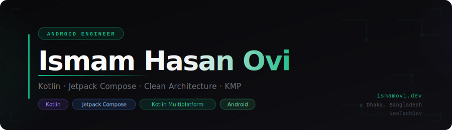

<!-- BANNER -->

  

<!-- TYPING ANIMATION -->

  

<!-- BADGES ROW -->

  &nbsp;
  &nbsp;
  &nbsp;
  &nbsp;
  &nbsp;
  

---

<!-- SPOTIFY -->

  

---

## 🧑‍💻 About Me

I'm **Ovi** — an Android Developer passionate about building **intuitive mobile experiences** and robust applications that solve real-world problems.

- 🔭 &nbsp;Building campus & productivity apps with **Jetpack Compose**
- 🌱 &nbsp;Exploring **Kotlin Multiplatform** for cross-platform apps
- ⚙️ &nbsp;Advocating **Clean Architecture** & scalable MVVM/MVI patterns
- 💻 &nbsp;Active on [Codeforces](https://codeforces.com/profile/ovi_001) — competitive programming
- 🌐 &nbsp;Portfolio: [ismamovi.dev](https://ismamovi.dev)
- 📫 &nbsp;Reach me: [ismamhasanovi@gmail.com](mailto:ismamhasanovi@gmail.com)

> *"Powered by Coffee & Code ☕"*

## 🚀 Featured Projects

<table border="0" width="100%">
<tr>
<td width="50%" valign="top">

#### 📱 [DIU Campus Schedule](https://ismamovi.dev/projects/diu-campus-schedule/)
> *Lead Developer · 2025 · Android*

A complete campus assistant for Daffodil International University. Helps students & faculty manage schedules, tasks, notes, and more — all in one place.

`Kotlin` `Jetpack Compose` `MVVM` `Firebase` `Room`

</td>
<td width="50%" valign="top">

#### 🔇 [SilentSync](https://ismamovi.dev/projects/silentsync/)
> *Lead Developer · 2025 · Android*

Smart silent mode scheduler that automates sound profiles based on time & geofenced locations. Never forget to silence your phone again.

`Kotlin` `Compose` `WorkManager` `Google Maps SDK` `Geofencing`

</td>
</tr>
<tr>
<td width="50%" valign="top">

#### 🌐 [DIU Campus Schedule Web](https://ismamovi.dev/projects/diu-campus-schedule-web/)
> *Lead Developer · 2025 · PWA*

A Progressive Web App for DIU students & teachers — class routines, exam schedules, faculty info, and available room tracking. All in one place.

`Next.js` `TypeScript` `Firebase` `PWA` `React`

</td>
<td width="50%" valign="top">

#### 🧠 [Brainforge](https://ismamovi.dev/projects/brainforge/)
> *Lead Developer · 2026 · Full-Stack*

Collaborative Idea Marketplace — publish ideas, discover others', upvote, comment, request collaboration, form teams and build together.

`Next.js` `TypeScript` `Node.js` `Firebase`

</td>
</tr>
<tr>
<td width="50%" valign="top">

#### 🐾 [Pet Adoption Platform](https://ismamovi.dev/projects/pet-adoption/)
> *Lead Developer · 2024 · Desktop*

Connects pet shelters with potential adopters through an intuitive JavaFX interface and robust data management system.

`Java` `JavaFX` `MySQL` `JDBC`

</td>
<td width="50%" valign="top">

#### 📍 [Where](https://github.com/GalvanHQ/where-android)
> *Lead Developer · 2026 · Android*

Advanced location tracking & group management app with real-time map synchronization and robust background location services.

`Kotlin` `Compose` `Maps SDK` `Realtime DB` `Background Services`

</td>
</tr>
</table>

---

## 🛠️ Tech Arsenal

<table border="0" width="100%">
  <tr>
    <td width="28%"><b>📱 Mobile</b></td>
    <td>
      
      
      
      
    </td>
  </tr>
  <tr>
    <td><b>🏗️ Architecture</b></td>
    <td>
      
      
      
      
    </td>
  </tr>
  <tr>
    <td><b>📚 Libraries</b></td>
    <td>
      
      
      
      
      
      
    </td>
  </tr>
  <tr>
    <td><b>☁️ Backend</b></td>
    <td>
      
      
      
    </td>
  </tr>
  <tr>
    <td><b>🌐 Web</b></td>
    <td>
      
      
      
    </td>
  </tr>
  <tr>
    <td><b>🔤 Languages</b></td>
    <td>
      
      
      
      
      
    </td>
  </tr>
  <tr>
    <td><b>🛠️ Tools</b></td>
    <td>
      
      
      
      
    </td>
  </tr>
</table>

---

## 📊 GitHub Insights

  

  
  

---

## 📡 Connect with Me

  &nbsp;
  &nbsp;
  &nbsp;
  &nbsp;
  &nbsp;
  &nbsp;
  &nbsp;
  &nbsp;
  &nbsp;
  

---

*"Code is not just instructions for machines — it's a craft, a statement, and a legacy."*

 

&nbsp;&nbsp;

© 2026 Ismam Hasan Ovi · Designed & Engineered

